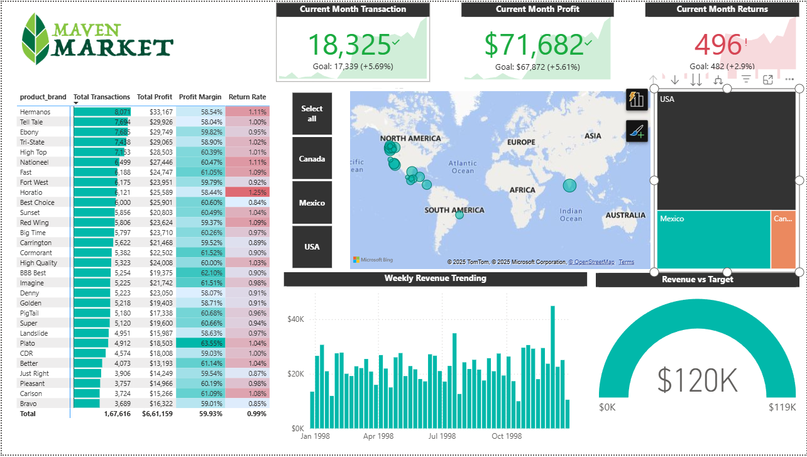

# Maven Market Power BI Dashboard

## 📌 Project Overview
This project is part of my Power BI learning journey and serves as the **capstone project** from the *Microsoft Power BI Desktop for Business Intelligence* course.  
It showcases how to build an **interactive business intelligence dashboard** for a fictional retail company, **Maven Market**, providing real-world business insights.

---

## ✅ Key Features
- **KPIs & Metrics**:
  - Current Month Transactions vs Goal
  - Current Month Profit vs Goal
  - Current Month Returns
  - Revenue vs Target Gauge
- **Visualizations**:
  - Geographical Map (Region Performance)
  - Weekly Revenue Trend
  - Top Product Brands (Profit Margins & Return Rates)
- **Advanced Features**:
  - Conditional formatting
  - Dynamic goals comparison
  - Data-driven insights

---

## 🛠 Tools & Technologies
- Power BI Desktop
- DAX (Data Analysis Expressions)
- Power Query
- Data Modeling

---

## 📂 Project Files
- `MavenMarket_Capstone.pbix` → Power BI dashboard file
- `maven_market_dashboard.png` → Dashboard preview image

---

## 📷 Dashboard Preview

---

## 🔍 Insights from the Dashboard
- Total Transactions: **167,616**
- Total Profit: **$61,159**
- Average Profit Margin: **59.93%**
- Return Rate: **0.99%**
- Top Brands with highest profit margins & returns highlighted
- Region-wise performance analysis

---

### 🚀 How to Use
1. Download the `.pbix` file.
2. Open it in **Power BI Desktop**.
3. Explore interactive filters and visuals.

---

### 📌 Connect with Me
[LinkedIn](https://www.linkedin.com/in/vaibhav-vai)
---

⭐ If you found this useful, consider **starring the repo**!
